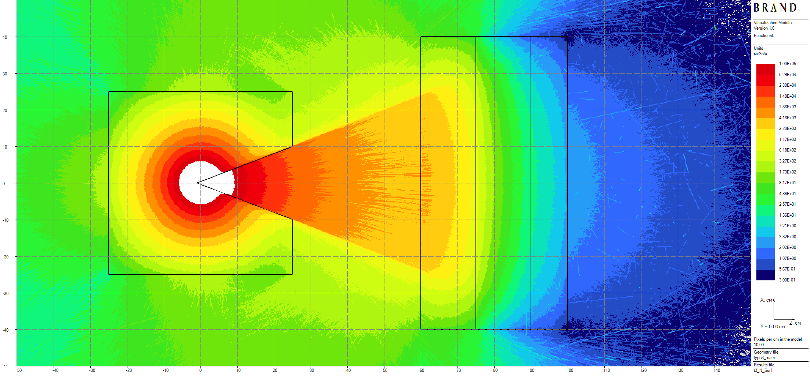
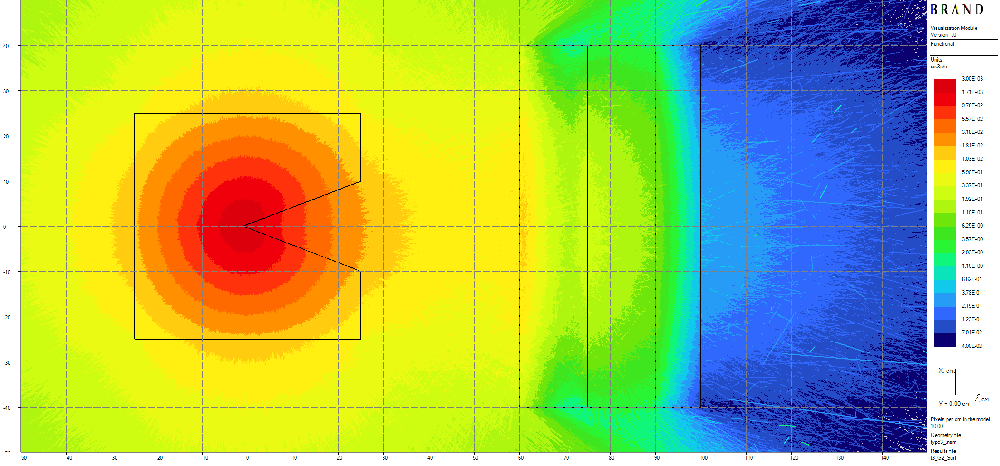

# Radiation shielding Monte Carlo evaluations

List of problems:
 * [Ueki experiment (Type 3)](#ueki-experiment-type-3);
 * [Protvino labyrinth benchmark ALARAM-CF-AIR-LAB-001](#protvino-labyrinth-benchmark-alaram-cf-air-lab-001).

# Ueki experiment (Type 3)
Californium-252 neutron source of intensity 5.33E8 n/s is placed into paraffinn conic collimator.
The goal is computation of neutron and secondary (capture) gamma dose rates behind 3-layered shield
 of steel (25 cm) - polyethylene (15 cm) - steel  (10 cm) slabs.
 
Thicknesses of volumetric detectors are equal to 2 cm. Results of computations are given in Figures 1 and 2.

||
|:--:|
| Figure 1: Neutron ANSI77 dose rates plot, mcSv/h |

||
|:--:|
| Figure 2: Secondary gamma ANSI77 dose rates plot, mcSv/h |

# Protvino labyrinth benchmark ALARAM-CF-AIR-LAB-001
Californium-252 neutron source of intensity 5.66E8 n/s is located on entrance to 3-section concrete labyrinth.
The goal is computation of a neutron flux linear fuctional which relates to Bonner sphere detector count rates.
Detector response function is taken from the benchmark data for the case of 5 in polyethylene sphere diameter.
Those are considered Case 5A with 2 polyethylene plates in 2nd section and Case 6B with covered source
and death end.

Thicknesses of volumetric detectors are equal to 10 cm. Results of computations are given in Figures 3-5.

||
|:--:|
| Figure 3: Global plot of count rates spatial distribution for Case 5A, pulses/sec |

||
|:--:|
| Figure 4: Local plot of count rates spatial distribution for Case 5A, pulses/sec |

||
|:--:|
| Figure 4: Plot of count rates spatial distribution rates for Case 6B, pulses/sec |

# References
1. K. Ueki, A. Ohashi, Nobuteru Nariyama, S. Nagayama, T. Fujita, K. Hattori, and Y. Anayama.
Systematic evaluation of neutron shielding effects for materials. Nuclear Science and Engineering,
124:455–464, 10 1996.
2. Mark Nikolaev, Natalia Prokhorova, Tatiana Ivanova, “Neutron Fields in Three-Section Concrete 
Labyrinth from Cf-252 Source,” ALARAM-CF-AIR-LAB-001, “International Handbook of Evaluated Criticality 
Safety Benchmark Experiments,” OECD Nuclear Energy Agency, NEA-1486/19, 2021 (DVD).
